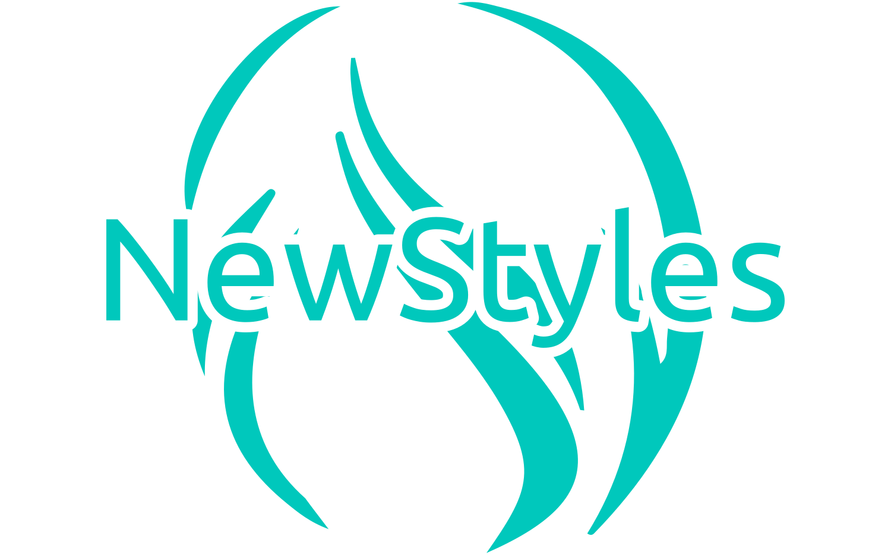

    

NEWSTYLES

Daniel Gallego Calderón (Curso 2023/24)

# Descripción general del proyecto

NewStyles es una aplicación web que se encarga de toda la gestión de todos los tipos de usuarios que puede
tener una peluquería, desde la reserva de citas con total libertad para elegir a su peluquero preferido, 
la administración de todos los posibles datos, o que los propios peluqueros decidan como repartirse sus horarios.
Además podrá comprar productos especializados de peluquería directamente desde la web en pocos clics.

## Funcionalidad principal de la aplicación

El objetivo principal de la web acercar todo lo que ofrece esta empresa al usuario, que podrá
solicitar, modificar y cancelar citas y realizar pedidos de todos los productos en stock, además de observar el estado 
de todas sus solicited en la web, tanto sus citas y como sus pedidos. 

En cuanto a las citas, además, los clientes podrán modificar lo que consideren necesario siempre y cuando se encuentren dentro
del plazo para hacerlo. Pudiendo elegir a un nuevo peluquero, un nuevo servicio, una nueva hora o un nuevo día. Sobre los pedidos,
podrán ver el estado de estos, descargar un PDF con el recibo correspondiente y cancelarlos si no se han enviado.

Los clientes podrán darse de alta a través de la aplicación para así poder acceder a todas
las funcionalidades del sitio web. Además, podrán cambiar sus datos desde su propio perfil y contactar 
con la empresa vía email a través de la zona de contacto.

Por otra parte, los administradores tendrán acceso a toda la gestión de datos (servicios, usuarios, productos, etc.) del sitio web, pudiendo modificarlos, eliminarlos o añadir nuevas unidades según consideren necesario. 

Por último, los peluqueros tendrán la oportunidad de gestionar todas las citas que les soliciten, pudiendo elegir entre aceptarlas o cancelarlas, además de poder gestionar
sus horarios como crean conveniente, bloqueando y desbloqueando horas en las que quieran tener citas.

## Objetivos generales

* Objetivo: Solicitud y gestión de citas y pedidos en una peluquería.

* Casos de uso: 
    - Invitado: "Iniciar sesión", "Registrarse", Añadir al carrito.
    - Usuario: "Solicitar cita", "Cancelar cita", "Modificar Cita", "Añadir al carrito", "Vaciar carrito", "Realizar un pedido", "Cancelar pedido", "Filtrar productos", "Filtrar servicios", "Modificar perfil", "Descargar PDF recibo", "Contactar vía email".
    - Administrador: "Crear usuarios", "Modificar usuarios", "Eliminar usuarios", "Añadir productos", "Eliminar productos", "Modificar productos", "Añadir servicios", "Eliminar servicios", "Modificar servicios", "Añadir bloqueos de hora", "Modificar bloqueos de hora", "Eliminar bloqueos de hora", "Añadir cita", "Modificar cita", "Eliminar cita", "Cambiar estado pedido", "Eliminar pedido"

# Elemento de innovación
* Inertia + Ziggy. 
* Pago vía Paypal.
* Pago vía Tarjeta de crédito/débito.